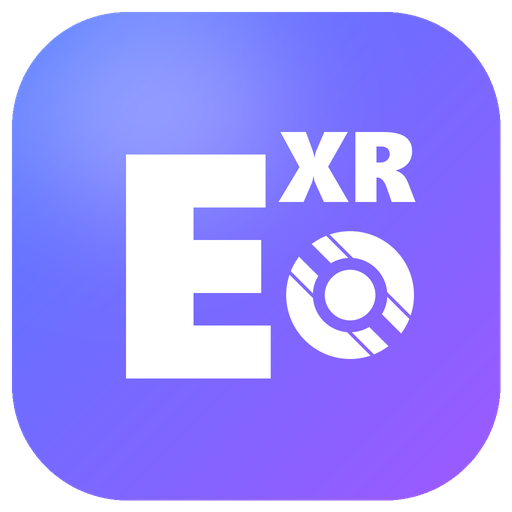

# EchoFrame



**EchoFrame** (EchoQuestXR inside: its runtime, log tags and files keep that name) runs the
**Echo VR Quest APK on OpenXR**: on Quest through Meta's OpenXR runtime, and
aimed at standalone Steam Frame (through Valve's Lepton Android container) and other
OpenXR headsets.

Echo's Quest build talks to the headset through Meta's **VrApi** (`libvrapi.so`, loader
1.1.40), which only works on Meta's own runtime. EchoQuestXR replaces that one library
with its own `libvrapi.so` that implements the same functions on OpenXR. The game engine
(`libr15.so`) calls only 35 of VrApi's 114 functions, rendering is Vulkan, and nothing
else in the APK changes.

This repository ships **no game files, no APKs and no logs**. You supply your own Echo VR APK.

## Status

| Step | State |
| --- | --- |
| 1. VrApi logger: record every call Echo makes on a Quest 3 | ✅ [docs/vrapi-calls.md](docs/vrapi-calls.md) |
| 2. Button layout (press each button once) | ✅ same document |
| 3. `libvrapi.so` on OpenXR, on Quest 3 | ✅ plays: view, head tracking, hands, every button, throwing |
| 4. Package for Lepton and test on Steam Frame | ✅ plays in matches: view, head and hand tracking, the Frame's controllers (button layout in the window), voice chat both ways; 72 fps in menus, 60-72 in matches |

Tested on a Quest 3 (Horizon OS, Meta OpenXR runtime 85) and a Steam Frame (SteamOS, SteamVR,
Lepton) with Echo VR build 4987566.

## Patching your APK (`patcher/`)

A step-by-step window (your headset, your APK, make it, connect, install, button layout on
the Frame, play): choose your Echo VR APK, and it writes a patched copy next to it.
**Advanced** (bottom left) is a terminal on the headset (adb shell; SteamOS on a Frame).

```bash
pip install -r patcher/requirements.txt
pythonw patcher/gui.pyw            # or: python patcher/patch.py <echo.apk>
```

It makes three changes: `lib/arm64-v8a/libvrapi.so` becomes the EchoQuestXR runtime,
`lib/arm64-v8a/libopenxr_loader.so` (the Khronos OpenXR loader) is added, and the manifest
gets a `LAUNCHER` entry plus the OpenXR permissions (Lepton on Steam Frame needs the first;
both are harmless on Quest). The result is
signed with **your own random key**, made the first time and saved next to it as
`.signing-key.pem` (keep it private), so no two people share a signing key. Patching to the
same file again reuses that key, so the new APK updates Echo in place: Android (and Lepton)
uninstall an app whose key changed, which deletes its app data, and on Steam Frame its game data.

The later steps do the rest, over USB (or, on a Frame, its Wi-Fi adb address):
- **Install**: the patched APK (if Echo VR on the headset was signed with another key, it asks
  before uninstalling it; that removes Echo's app data on the headset), then, ticked by
  default, **Echo's game data**: `_data.zip` from the same mirrors as the
  [Echo VR installer app](https://github.com/heisthecat31/EchoVR-Installer) (about 900 MB,
  downloaded once, resumable), copied to `/sdcard/Android/media/com.readyatdawn.r15/files/`
  where Echo reads it, plus the installer's asset patches (sha256-checked). A headset that
  already has game data is left as it is (Echo updates it itself; the zip could be older),
  and `config.json` (the community-server login) is never touched.
- **Launch**, and **Save logs** (everything Echo's process logged, its own log included, plus
  the crash log and the OpenXR runtime's lines). If the headset's shell
  can't run `logcat`, the saved file says what that shell is instead.

adb (Google's platform-tools) installs itself when the window opens, into
`%LOCALAPPDATA%\EchoQuestXR` for the `.exe`. By hand:

```bash
adb install <your-echo>_openxr.apk
```

The patcher needs the two runtime libraries: in `patcher/runtime/` (a release puts them
there), or built from source into `build/` (below).

## Windows release

```bash
python tools/make_release.py        # build/release/EchoQuestXR-Patcher-v<VERSION>.exe and .zip
```

A standalone `.exe` (PyInstaller): the patcher window with the runtime libraries inside, so
users need nothing else. The zip adds README.txt and THIRD_PARTY_NOTICES.txt. Needs
everything the runtime build needs, plus `cryptography`, Pillow and PyInstaller. The version
is in `VERSION`.

## Building the runtime (`runtime/`)

Needs the Android NDK (default `J:\AndroidSDK`, or set `ANDROID_HOME`), CMake, Ninja and the
OpenXR SDK source (`OPENXR_SDK`, default: EchoXR's `xr/OpenXR-SDK` checkout).

```bash
python runtime/build.py --lib-only                              # build/libvrapi.so, libopenxr_loader.so, libovrplatformloader.so
python runtime/build.py --apk <echo.apk> --ks <keystore>        # also a test APK signed with your key
```

`runtime/vrapi_openxr.cpp` maps VrApi onto OpenXR; `runtime/vrapi_layouts.h` holds the
VrApi structures as recorded from the real thing, with every offset checked at compile
time. Things worth knowing:

- **Foveation maps.** Echo always renders with a fragment density map for each swapchain
  image, so the runtime makes real ones (full density) and enables `VK_EXT_fragment_density_map`.
  Without them the GPU silently drops Echo's rendering.
- **Image orientation.** VrApi's images are bottom-up; the runtime flips them by swapping
  each eye's up and down field-of-view angles.
- **Controllers** use the OpenXR aim pose, which matches VrApi's.
- **Swapchain images.** Echo picks its image round-robin itself; the runtime keeps OpenXR's
  acquire order in step with it.

Properties (read when Echo starts; `adb shell setprop <name> <value>`):

| Property | Effect |
| --- | --- |
| `debug.echoquestxr.pose grip` | controllers from the grip pose instead of aim |
| `debug.echoquestxr.flip 0` | don't flip the images |
| `debug.echoquestxr.test red` / `probe` / `redprobe` | display-path diagnostics |
| `debug.echoquestxr.semguard 0` / `1` | semaphore guard off / on (default: on except on Meta's runtime) |

The **semaphore guard**: Mesa (Steam Frame), in its threaded submit mode, blocks inside
`vkQueueSubmit` until every binary semaphore the submit waits on has its signal in the
kernel, and Echo's main loop hung there in its first frames. On the Frame build all of Echo's
submits go to one queue, which runs them in order, so the runtime swaps the submit, present,
acquire and destroy entries in Echo's Vulkan function table for wrappers that drop waits on
semaphores signaled on the same queue (and on ones nothing signaled), keeping waits on
window-image acquires. It logs the first 60 calls in full (`semaphore guard: ...`).

Logs: `adb logcat -s EchoQuestXR`. If Echo stops polling VrApi for 4 seconds (a hang), the
runtime logs where each of Echo's threads is (`hang: ...` lines: library + offset, and the
function name where the library exports one), at most 3 times per run.

## The logger (`logger/`)

A stand-in `libvrapi.so` that logs each VrApi call and forwards it to Meta's original
(renamed `libvrapi_real.so` in the APK). It's how `docs/vrapi-calls.md` was recorded.

```bash
python logger/build.py --apk <your-echo.apk> --ks <keystore>
```

Sign it with the key of the copy installed on the headset so it installs as an update.

## Steam Frame

Ready on the EchoQuestXR side, untested on a Frame:
- Lepton packaging: `LAUNCHER` entry and OpenXR permissions in the manifest (`patcher/axml.py`);
  OpenXR 1.0 only; refresh-rate requests are optional.
- Vulkan: extensions the driver lacks are left out (logged), so device creation can't fail
  on them. Echo needs `VK_EXT_fragment_density_map` to draw; without it, expect a black view.
- Controllers: Steam Frame (`XR_VALVE_frame_controller_interaction`: right A/B as A/B, left
  d-pad down/up as X/Y, View as menu), Valve Index and the generic simple controller, as
  well as Touch.

How it fits Lepton (from [Frame Control](https://github.com/saphid/frame-control)'s
`docs/apks.md` and what the Frame reported):
- Echo runs as its own Lepton instance, set up the way Frame Control sets up an app
  (`patcher/frame_setup.py`, on the first Install): `~/Applications/Android/com.readyatdawn.r15/`
  holds `app.apk`, Frame Control's `launch.sh`, `instance.id`, `shortcut.id` and `meta.json`,
  plus a VR Steam shortcut added through the Steam client's DevTools (`127.0.0.1:8080`).
  `launch.sh` needs **Lepton Development** (Steam app 3056000); Install queues it in Steam if
  it's missing, then starts Echo once so Lepton makes Echo's data folder.
- Echo runs in podman container `lepton-steamlaunch-<instance.id>`. Only `~/.local/share/Steam`
  is mounted in it. Lepton's `/sdcard` is rebuilt with its Android snapshot, but Echo's private
  folder `/data/data/com.readyatdawn.r15` is kept, as
  `~/.local/share/Steam/steamapps/compatdata/<instance.id>/internal/com.readyatdawn.r15`.
- The Frame's adb (USB, or its Wi-Fi address) is a SteamOS shell, not Android's.

So the Frame build (**For Steam Frame** in the window, `patch.py --frame`) changes every
`/sdcard/Android/media/com.readyatdawn.r15` in `libr15.so` and `libassetpatch.so` to
`/data/data/com.readyatdawn.r15`, in place (the new path is shorter). It also changes three
instructions in Echo's `CGS::Initialize` for the Frame's Mesa driver
(`FRAME_CODE_PATCHES` in `patcher/patch.py`):
- Echo asks for Vulkan apiVersion 1 (that is 0.0.1), which Quest's driver accepts but Mesa
  doesn't (no core functions, then `VK_ERROR_INCOMPATIBLE_DRIVER`); the Frame build asks for 1.0.
- Echo reads only the first 128 device extensions and leaves out any VrApi extension it
  didn't see ("Required extension ... does not exist"). Mesa lists far more, so the ones
  SteamVR needs (Android hardware buffers, foreign queue family) were left out and Echo
  crashed. The Frame build enables every extension the runtime asks for; the runtime only
  asks for ones the driver has.
- Echo reserves two queues in the graphics family, one for rendering and one for its
  uploader. Mesa has one queue there, so the uploader's queue stayed NULL and its first
  `vkQueueSubmit` crashed in `libvulkan.so`. The Frame build gives the uploader the render
  queue when its own reservation fails; with two queues (Quest) it still gets its own.

It also replaces `libovrplatformloader.so`, Meta's Platform SDK loader. Meta's needs Horizon
OS's `com.oculus.platformsdkruntime`; on the Frame it doesn't find it, tries to show
`com.oculus.systemactivities`' error screen, and throws, which aborted Echo as soon as it
created its OVR provider ("Creating OVR provider", then `OVRPlatform-Loader: DisplayErrorAndExit:
Failed to launch SystemActivities`). Echo's `-noovr` switch is no way around it: it only swaps
in a `pnsdemo` provider that isn't in the APK. The stand-in (`runtime/ovrplatform_standin.c`)
exports the same 1154 C functions; the 175 Echo's provider (`libpnsovr.so`) calls answer
locally: the Platform SDK starts, the entitlement check passes (an error there makes Echo
exit), the logged-in user, user proof and access token come back for a stand-in user, and
friends, purchases and invites come back empty. Rooms and Meta's invite, friend and checkout
panels get "not available" errors, which Echo logs and carries on from. The microphone and
VoIP give silence. Echo still logs in to the community servers with its own `config.json` (the
community build hard-codes the Platform SDK user ID it sends). The stand-in logs each request
type once as `EchoQuestXR: Platform SDK: ...`. The Quest build keeps Meta's loader.

The runtime finds out which device extensions the driver has with a throwaway Vulkan
instance, made before Echo's own: Lepton loads Valve's `fdm_injection` and `fossilize`
layers into every instance, and one made and destroyed between Echo's instance and its
device crashed Echo inside `vkCreateDevice`. Over the Frame's adb the
window then: **Install** replaces `app.apk` and copies the game data into that private folder
(through `podman unshare`, owned by Echo's user); **Launch** starts the Steam shortcut;
**Save logs** runs `logcat` inside Echo's container. Echo has to have started once so its
private folder exists.

1. Turn on Developer Mode on the Frame and plug it in with USB-C.
2. In the window: choose Steam Frame, make the APK, Install (the first time it also sets up
   Lepton, the Steam shortcut and Echo's data folder; keep the headset awake), Launch,
   Save logs. The
   log's EchoQuestXR lines list the OpenXR extensions, the Vulkan extensions left out, and
   any swapchain-format problem.
   If Echo has crashed, Save logs also copies its newest crash dump next to the log
   (`<log>-crash.dmp`) and adds where it crashed: the signal, pc and lr as library + offset,
   and the return addresses on the crashing thread's stack.

## Not done yet

- Hand-tracking devices aren't offered to Echo (it only reads the controllers).
- Haptics follow VrApi's buffer format as best understood; untested in detail.
- Some community builds of Echo print the EchoVRCE login (with its password) in Echo's own
  log, which Save logs keeps: check a log before sharing it if yours does.

## License

EchoFrame (EchoQuestXR) is released under the [MIT License](LICENSE), Copyright (c) 2026
heisthecat31.

It doesn't include Echo VR: you patch your own copy. Parts by others keep their own licenses:
- `patcher/frame_setup.py`'s `launch.sh` and Steam shortcut code come from
  [Frame Control](https://github.com/saphid/frame-control), MIT, Copyright (c) 2026 saphid.
- The [Khronos OpenXR loader](https://github.com/KhronosGroup/OpenXR-SDK) put into patched
  APKs is Apache License 2.0 (with JsonCpp, MIT).
- Releases bundle Python, PyInstaller's bootloader and `cryptography`; their notices are in
  the release's `THIRD_PARTY_NOTICES.txt`.
